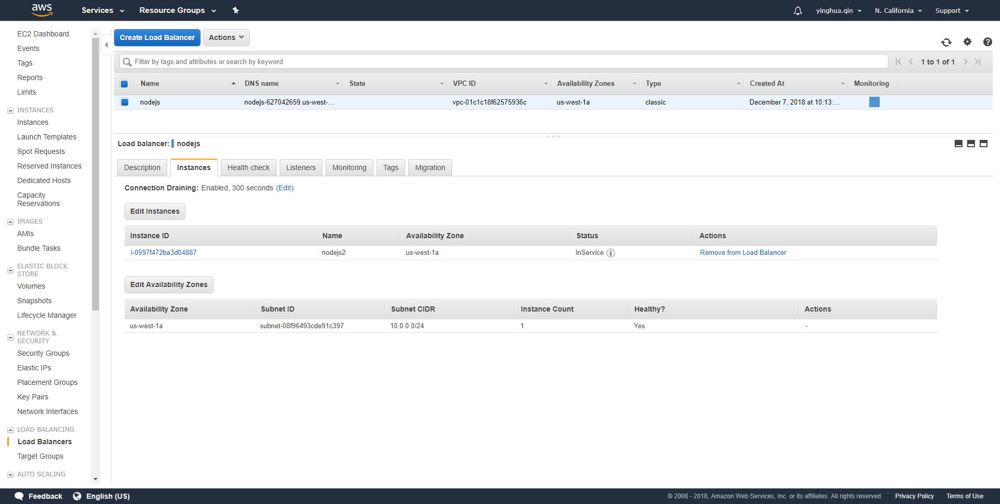
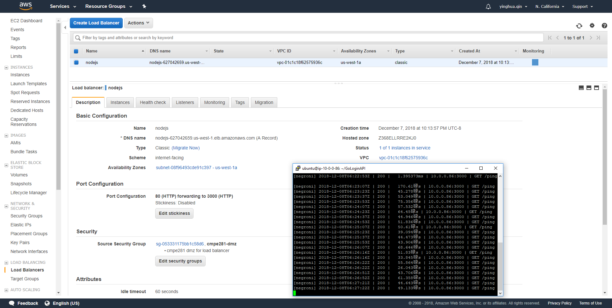
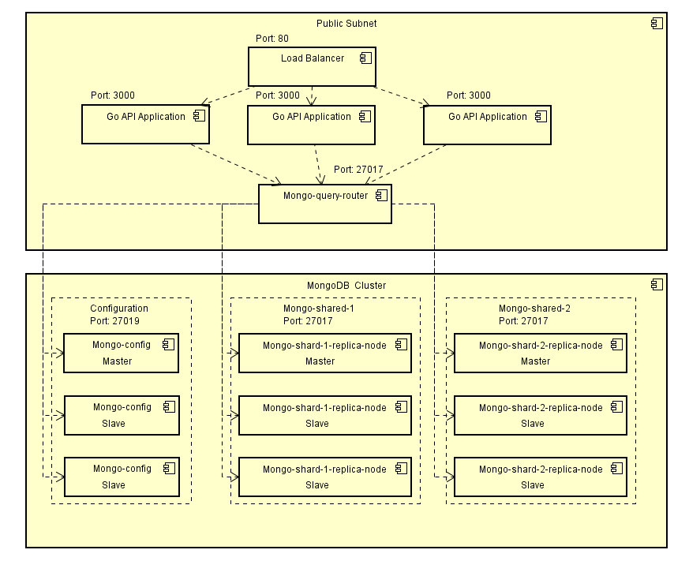

# Go Login API

## Database setup

Go to the Mongo Query Router EC2 instance.

```

mongo
use cmpe281
db.createCollection("cmpe281")

db.cmpe281.insert( { "name":"oliver", "password":"123" })
db.cmpe281.insert( { "name":"harry", "password":"456" })
db.cmpe281.insert( { "name":"emma", "password":"789" })
db.cmpe281.insert( { "name":"sophia", "password":"124" })
db.cmpe281.insert( { "name":"jack", "password":"125" })
db.cmpe281.insert( { "name":"oliver1", "password":"a123" })
```
## Testing the basic ping

    curl localhost:3000/ping


## Testing the Go API Sign up with CURL

    curl -H "Content-Type: application/x-www-form-urlencoded" -X POST http://54.176.179.159:3000/signup -d "name=oliver4" -d "password=123"
    {
    "error": "Name Already Existed"
    }
    
    curl -H "Content-Type: application/x-www-form-urlencoded" -X POST http://54.176.179.159:3000/signup -d "name=ol" -d "password=123"
    {
    "error": "length of password and name must larger than 2!"
    }
    
    curl -H "Content-Type: application/x-www-form-urlencoded" -X POST http://54.176.179.159:3000/signup -d "name=oliver4" -d "password=123"
    {
    "_id": "5c084a235e23ff7d7104b9e6",
    "name": "oliver4",
    "password": "123"
    }

## Testing the Go API Login with CURL

    curl -H "Content-Type: application/x-www-form-urlencoded" -X POST http://localhost:3000/login -d "name=oliver" -d "password=123"


    curl -H "Content-Type: application/x-www-form-urlencoded" -X POST http://54.176.179.159:3000/login -d "name=oliver4" -d "password=123"
    {
    "_id": "5c084a235e23ff7d7104b9e6",
    "name": "oliver4",
    "password": "123"
    }
    
    curl -H "Content-Type: application/x-www-form-urlencoded" -X POST http://54.176.179.159:3000/login -d "name=oliver5" -d "password=123"
    {
    "error": "Not found Name"
    }

## Setup Go EC2 Instance

1) Install go

    curl -O https://storage.googleapis.com/golang/go1.9.3.linux-amd64.tar.gz
    tar -xvf go1.9.3.linux-amd64.tar.gz
    sudo chown -R root:root ./go
    sudo mv go /usr/local

2) Go build

    vi ~/.profile
    
    Using a text editor, open the ~/.profile file and add the following two lines to the bottom of the file:
    
    export GOPATH=$HOME/go
    export PATH=$PATH:/usr/local/go/bin:$GOPATH/bin
    
    Save the file, and load the commands into the current shell instance:
    
    source ~/.profile
    
    export GOPATH=/home/ubuntu/GoLoginAPI
    
    go build goapi


### Create Load Balancer






## Go API and backend database deployment diagram



