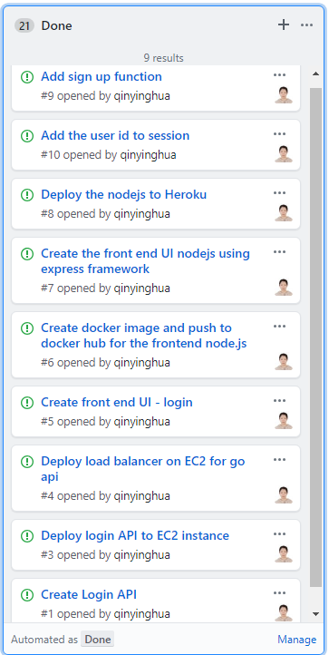

# Project Name: Starbucks Online Orders

### Submission (One per Team):**

- **The Topic of your team's project**
  - Starbucks Online Ordering Service
- **The names of each team member**
  - Yinghua Qin
  - Kody Han
  - Lakshmi Maduri
  - Sweety Sojrani
  - Vera Wang
- A summary of areas of contributions
  - Yinghua Qin
    - Login & Sing Up
    - Architecture diagram
    - Frontend structure
    - Documentation
  - 
  - Catalog - Lakshmi
  - Payment - Sweety
  - Create/Process order - Vera
  - Kong Gateway/Kubernetes Service - Kody
  - Frontend: All Members
- Link to your team's GitHub Repo
  - **Include one of your team member's GitHub Account for transfer (\*)**
  - https://github.com/qinyinghua
    https://github.com/vera37
    https://github.com/lakshmimaduri
    https://github.com/SweetySojrani
    https://github.com/kodyhan
- **Link to your team's Project Board (on GitHub)**
  - https://github.com/nguyensjsu/fa18-281-sky/projects/1
- **Link to your team's Project Journal (on GitHub)**
  - https://github.com/nguyensjsu/fa18-281-sky/blob/master/README.md
  - https://github.com/nguyensjsu/fa18-281-sky/blob/master/Project%20Journal.md
    https://github.com/nguyensjsu/fa18-281-sky/blob/master/Weekly%20Meeting%20Notes.md

**(\*) At the end of the semester, the team's Repo will be releasedfor Public access visible on this GitHub Account.**