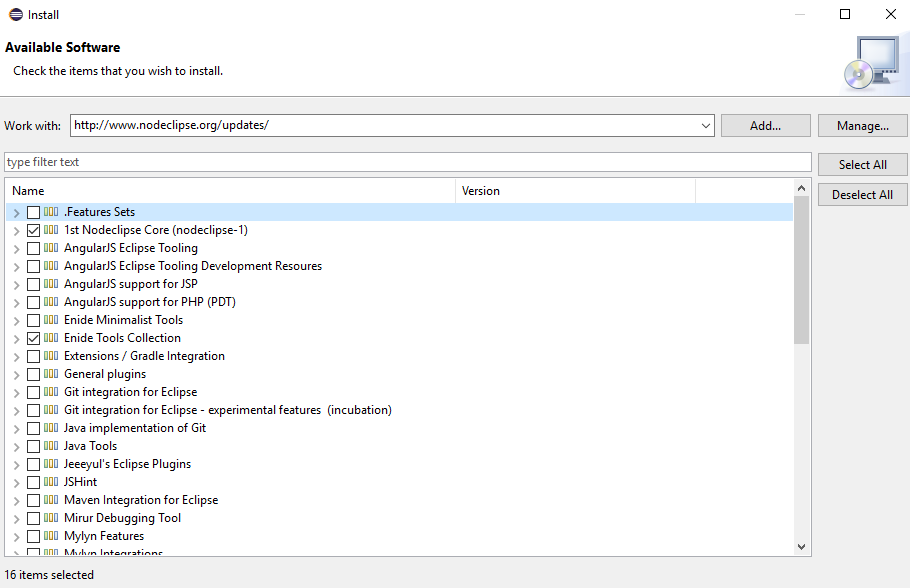

# Project Name: Starbucks Online Orders


### Instruction - How to run the Application

In this Front End UI folder, run below command to download the node modules

    npm install

Run the application

    node server.js

### Instruction - How to setup Eclipse for Nodejs environment

##### Install the nodeclipse plugin

```
npm install -g nodeclipse
npm install -g express
npm install -g express-generator
```

Install the Eclipse plugins

1. Start Eclipse, then select Help > Install New Software...

2. Enter the update site URL into the Work with text box:
   http://www.nodeclipse.org/updates/

3. Choose "1st Nodeclipse Code" and "Enide Tools Collection"

   

4.  Restart Eclipse

5.  Switch to Node perspective (e.g. Window -> Open Perspective -> Other ... -> Node).

6.  Start to write code

7.  Run as node application in Eclipse IDE

8.  Go to browser to open http://localhost:3000/


### Instruction - How to build the application as a container

Build a container image. Upload to the docker hub .

```
docker build .
docker login --username=qinyinghua --email=yinghua.qin@sjsu.edu

docker images

docker tag cc8f3d662aa6 qinyinghua/starbucksnodejs:0.1

docker push qinyinghua/starbucksnodejs

docker run -it -p 80:4000 -p 81:3000 --name starbucks qinyinghua/starbucksnodejs:0.1

```

### Get the container image and deploy to Kubernetes 

Create the Kubernetes deployment, service, pod configuration YAML files.

```
kubectl create -f kubernetes-namespace.yaml
kubectl create -f starbucks-deployment.yaml
kubectl create -f starbucks-service.yaml
```


### Instruction - How to deploy the application to heroku

As only the front end part will deploy to Heroku, so create a new folder cmpe281team and copy the front end source code there. 

```
$ heroku login
$ heroku git:clone -a cmpe281team
$ cd cmpe281team

$ git add .
$ git commit -am "make it better"
$ git push heroku master

After that, found some issue of Heroku yaml file parsing. 
Try to fix it by running: 

npm install js-yaml


```

