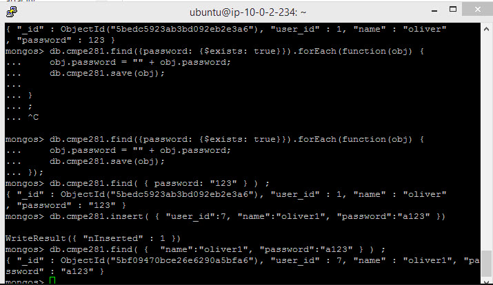
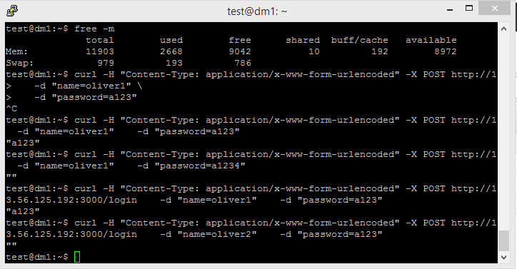
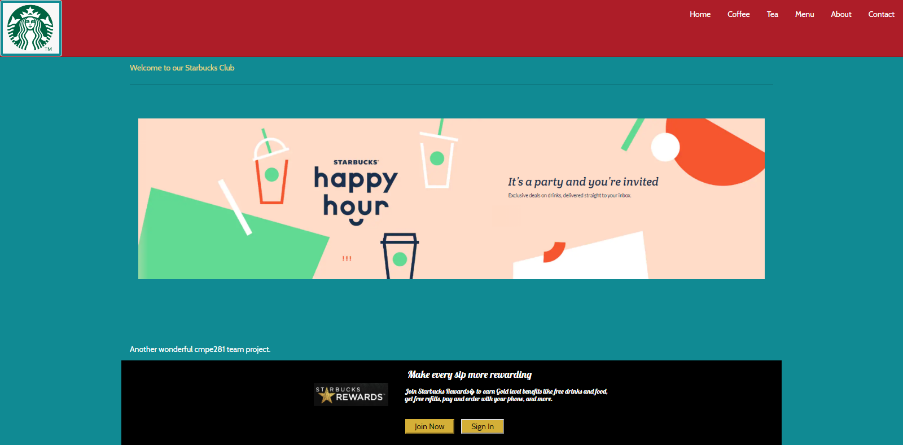
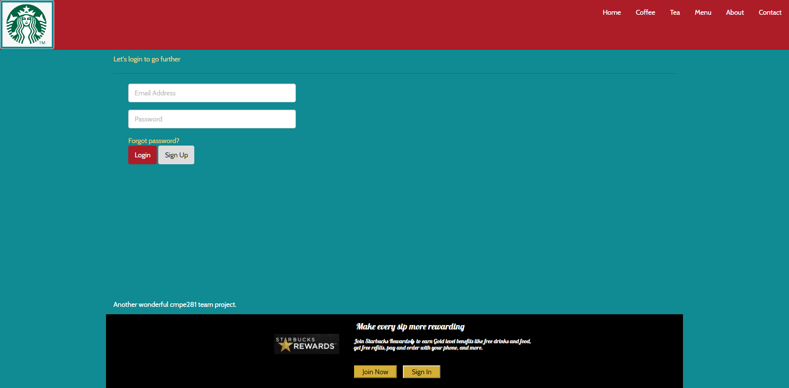
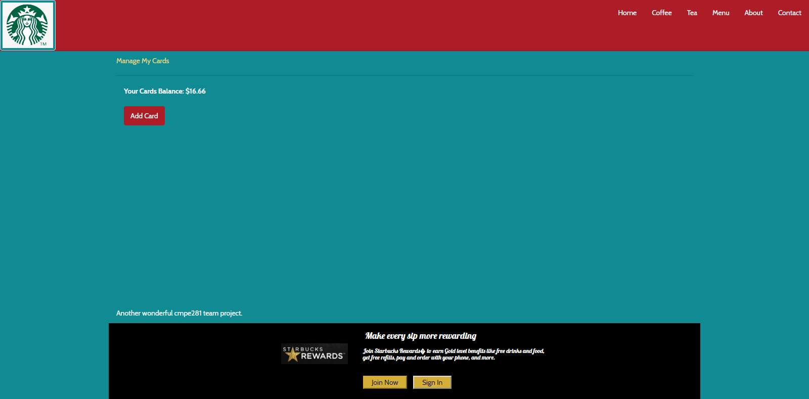
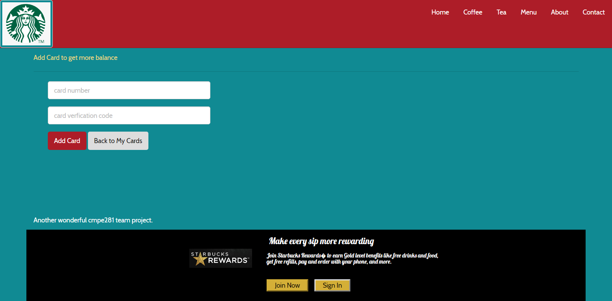
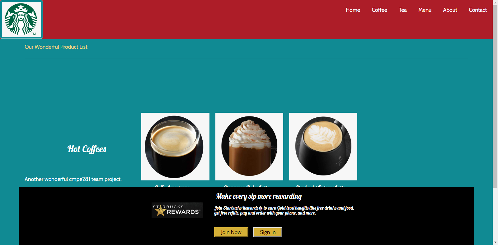
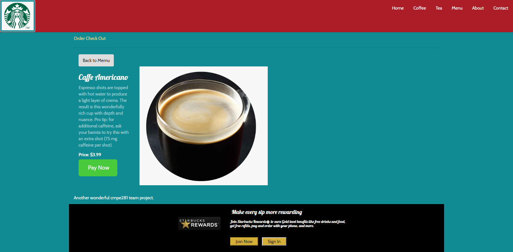
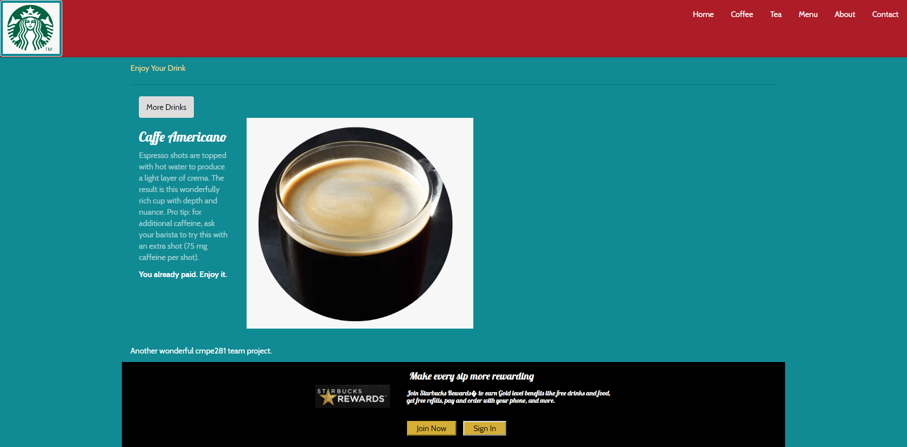

# Project Journal

## Week #1 

### Part 1 - Go API for Login (Yinghua)

- #### What I have done this week

  - Setting up the Go at EC2 instance for Go API Application

  - Go to the Mongo Query Router EC2 instance.

    Install go:

    ```
    wget https://dl.google.com/go/go1.11.1.linux-amd64.tar.gz 
    tar -C /usr/local -xzf go1.11.1.linux-amd64.tar.gz
    export PATH=$PATH:/usr/local/go/bin
    
    vi ~/.profile
    	export GOPATH=$HOME//goapi
    	export PATH=$PATH:/usr/local/go/bin:$GOPATH/bin
    
    source ~/.profile
    cd ~/goapi
    go build goapi
    ./goapi      //start Go API service
    ```


## Week #2

### Part 1 - Go API for Login (Yinghua)

- #### What I have done this week
  - Adding data collection steps 

  - Document the setting of data collection

    ###### Journal of setting up the Mongo data collection for Go API.

    Go to the Mongo Query Router EC2 instance.

        sudo systemctl restart mongodb
        mongo
        use cmpe281
        db.createCollection("cmpe281")
        
        db.cmpe281.insert( { "user_id":1, "name":"oliver", "password":"123" })
        db.cmpe281.insert( { "user_id":2, "name":"harry", "password":"456" })
        db.cmpe281.insert( { "user_id":3, "name":"emma", "password":"789" })
        db.cmpe281.insert( { "user_id":4, "name":"sophia", "password":"124" })
        db.cmpe281.insert( { "user_id":5, "name":"jack", "password":"125" })
        db.cmpe281.insert( { "user_id":1, "name":"oliver1", "password":"a123" })

    		


## Week #3

### Part 1 - Go API for Login (Yinghua)

- #### What I have done this week

  - Implemented and deployed the Go API  is deployed to my individual project EC2 instance.

  - It connects to my individual project Mongo NoSQL Database Cluster with Sharding through the Mongo Query Router. 

  - Document how to use the login API

    ###### How to use the Login API

    Run following curl command to test the login success case

    ```
    curl -H "Content-Type: application/x-www-form-urlencoded" -X POST http://13.56.125.192:3000/login \
       -d "name=oliver1" \
       -d "password=a123"
    
    curl -H "Content-Type: application/x-www-form-urlencoded" -X POST http://localhost:3000/login \
    -d "name=oliver&password=a123"
    ```

    Change the password from a123 to wrong_password to test the login fail case

    ```
    curl -H "Content-Type: application/x-www-form-urlencoded" -X POST http://localhost:3000/login \
    -d "name=oliver&password=wrong_password"
    ```

    	

    		


## Week #4

### Part 1 - Go API for Login (Yinghua)

- #### What I have done this week

  Implemented the front end UI framework

  Home Page

  

  Login

  

  Login Success - Show My Card Balance

  

  Add Card

  

  Product List

  

  One Product - click "Pay Now" to pay

  

  Paid

  


## Create Product Catalog 

### Steps to create Product Catalog 
1. SSH into mongo shell of EC2 Instance
2. Create database cmpe281
   <pre>
            use cmpe281;
   </pre>
3. Create collection 'products' and insert documents into it
   <pre>
            db.products.insert([
                {
                  "name": "Latte Macchiato",
                  "description": "Creamy whole milk with barista",
                  "price": 5,
                  "image_url": "https://globalassets.starbucks.com/assets/fb9eda922982444ea9871de8cbd29b67.jpg",
                  "count": 12
                },
                {
                  "name": "Doppio",
                  "description": "Two bold shots of expresso with cream",
                  "price": 7,
                  "image_url": "https://globalassets.starbucks.com/assets/d01fdcb3707c4c98ac575e89f3293b38.jpg",
                  "count": 10
                },
                {
                  "name": "Cappuccino",
                  "description": "Deeply delicious expresso with a light airy foam",
                  "price": 8,
                  "image_url": "https://globalassets.starbucks.com/assets/2237ef1d9dab486695b8e6269d41ab0a.jpg",
                  "count": 3
                }
            ]);
   
          db.products.insert([
            {
              "name": "Cinnamon Dolce Latte",
              "description": "Steamed milk and cinnamon dolce syrup added to classic expresso",
              "price": 10,
              "image_url": "https://globalassets.starbucks.com/assets/79883bdbd5634757a5ae1c8126f75451.jpg",
              "count": 14
            },
            {
              "name": "Caffe Mocha",
              "description": "Rich expresso with bitter-sweet mocha and steamed milk",
              "price": 9,
              "image_url": "https://globalassets.starbucks.com/assets/bc15a5ca9d744b66bda07254f2f50013.jpg",
              "count": 16
            },
            {
              "name": "Chai Latte",
              "description": "Black tea infused with cinnamon and clove with steamed milk and light foam",
              "price": 4,
              "image_url": "https://globalassets.starbucks.com/assets/f344c66e8de74a4faf5c65f4060cf1f7.jpg",
              "count": 15
            }
           ]);
           
           db.products.insert([
            {
              "name": "Pumpkin Spice Chai Tea Latte",
              "description": "Pumpkin and spices go great with steamed milk and light foam",
              "price": 6,
              "image_url": "https://globalassets.starbucks.com/assets/727b21c60eec40208098cb94903ebca0.jpg",
              "count": 20
            },
            {
              "name": "Honey Citrus Mint Tea",
              "description": "Herbal tea with steamed lemonade and a touch of honey is perfect for the cold weather!",
              "price": 3,
              "image_url": "https://globalassets.starbucks.com/assets/4bffd5c29ee644a5b810610c322f741a.jpg",
              "count": 30
            },
            {
              "name": "Morning Muffin",
              "description": "This healthy muffin has zucchini, carrots, crunchy nuts and a dash of cane sugar",
              "price": 2,
              "image_url": "https://globalassets.starbucks.com/assets/3f3ff719711d45b2993903a7a8d1549d.jpg",
              "count": 5
            },
            {
              "name": "Iced lemon pond cake",
              "description": "A moist lemon cake with sweet icing",
              "price": 2,
              "image_url": "https://globalassets.starbucks.com/assets/12014fa89261475798a3c3b7dcc54552.jpg",
              "count": 4
            }
           ]);

   </pre>
   
   ## Steps to run Nodejs api
   
   1. cd into the node_js_api directory 
   2. Run <pre>npm install</pre>
   3. Run <pre>npm start</pre> or <pre>node app.js</pre>
   

## Order API

1. Start Mongo cluster and create orders collection
2.  Use Kubernetes to start server
3. Tested with Postman

```
Create order API
curl -X POST \
  http://localhost:3000/order \
  -H 'Content-Type: application/json' \
  -d '{"UserId": "vera",
 "Items": [{
 	"Name": "Soy Latte",
 	"Price": "$3.5",
 	"Quantity": 1
 },
 {
 	"Name": "Cappucino",
 	"Price": "$4.0",
 	"Quantity": 1
 },
 {
 	"Name": "Macchiato",
 	"Price": "$3.0",
 	"Quantity": 1
 }]
}'

Get Order Status

curl -X GET \
  http://localhost:3000/order/1fe8d86b-298f-46d9-998a-d80d7713e554 \
  -H 'Content-Type: application/json' \
  -d '{"UserId": "vera"}'

Complete Order

curl -X POST \
  http://localhost:3000/order/1fe8d86b-298f-46d9-998a-d80d7713e554 \
  -H 'Content-Type: application/json' \
  -d '{"UserId": "vera"}'

Get orders history

curl -X GET \
  http://localhost:3000/orders \
  -H 'Content-Type: application/json' \
  -d '{"UserId": "vera"}'


```

## Deploy Kong on Google Cloud Platform Marketplace

1. Login to Google Cloud Platform
```
https://console.cloud.google.com
```
2. Create new project
3. Go to project 
   
4. Go to Project Settings
5. Select IAM on left sidebar
6. Edit permissions of your member ID and give role "Kubernetes Engine Admin"
  
7. Search the Marketplace for Kong or visit
```
https://console.cloud.google.com/marketplace/details/kong/kong
```
8. Press Configure
 
9. Deploy in default namespace
 