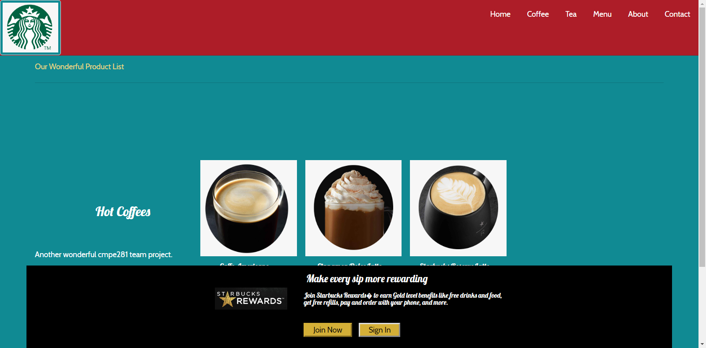
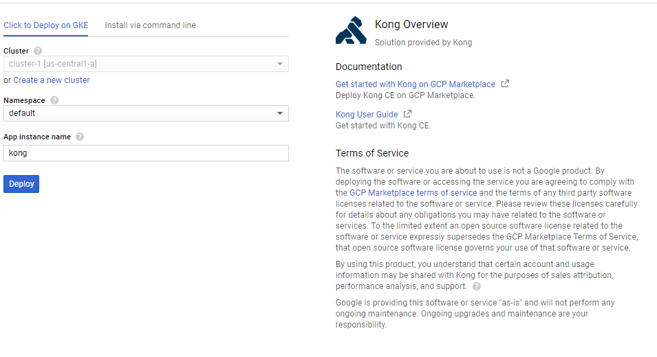

# \Project Name: Starbucks Online Orders

The idea is to leverage the individual project implementation of the No-SQL databases for backend database and create a full stack of distributed web application which be able to scale out on all layers and be able have network partition tolerance. 

#### Team Members:

- Yinghua Qin
- Kody Han
- Lakshmi Maduri
- Sweety Sojrani
- Vera Wang

#### Project Modules:

- Catalog - Lakshmi
- Payment - Sweety
- Login/Signup - Yinghua
- Create/Process order - Vera
- Kong Gateway - Kody
- Frontend: All Members


## Architecture

After evaluating several Kubernetes services on the cloud, including the Amazon EKS, Azure AKS and Google Cloud Container Server.  We designed to use the Google cloud container service - based on a cost comparison consideration.   We also use the Postgrad Database which could form a clustering on Kubernetes. Postgrad is a rational database with free license. 

On the front-end layer, we use the nodejs.  It also connect to the Google Analytics for data analysis. 

### Version #2 

In this version, we moved the frontend from Heroku to the Google Kubernetes service. 


### Version #1 

In this version, we use Heroku as the front end deployment. 


## Micro Services

Here are the micro services we implemented.

[GoLoginAPI](https://github.com/nguyensjsu/fa18-281-sky/tree/master/GoLoginAPI)       

[GoOrderAPI](https://github.com/nguyensjsu/fa18-281-sky/tree/master/GoOrderAPI)       

[GoPaymentAPI](https://github.com/nguyensjsu/fa18-281-sky/tree/master/GoPaymentAPI)        

[GoProductsAPI](https://github.com/nguyensjsu/fa18-281-sky/tree/master/GoProductsAPI)

## Front End

[FrontEnd](https://github.com/nguyensjsu/fa18-281-sky/tree/master/FrontEnd)  (Node Js)

## Presentation

CMPE Team Project Starbucks Online Store

http://docs.google.com/presentation/d/11eUHup_X2sBACVZNBFcr6DTY0KV0J3dWST_6N2AovDk/edit?usp=sharing_eil&ts=5c0be778


## Front End UI Pages

#### Home Page


#### Login


#### Login Success - Show My Card Balance


#### Add Card


#### Product List


#### One Product - click "Pay Now" to pay


#### Paid


# Project Journal

## Week #1 

### Part 1 - Go API for Login (Yinghua)

- #### What I have done this week

  - Setting up the Go at EC2 instance for Go API Application

  - Go to the Mongo Query Router EC2 instance.

    Install go:

    ```
    wget https://dl.google.com/go/go1.11.1.linux-amd64.tar.gz 
    tar -C /usr/local -xzf go1.11.1.linux-amd64.tar.gz
    export PATH=$PATH:/usr/local/go/bin
    
    vi ~/.profile
    	export GOPATH=$HOME//goapi
    	export PATH=$PATH:/usr/local/go/bin:$GOPATH/bin
    
    source ~/.profile
    cd ~/goapi
    go build goapi
    ./goapi      //start Go API service
    ```

## Week #2

### Part 1 - Go API for Login (Yinghua)

- #### What I have done this week

  - Adding data collection steps 

  - Document the setting of data collection

    ###### Journal of setting up the Mongo data collection for Go API.

    Go to the Mongo Query Router EC2 instance.

    ```
    sudo systemctl restart mongodb
    mongo
    use cmpe281
    db.createCollection("cmpe281")
    
    db.cmpe281.insert( { "user_id":1, "name":"oliver", "password":"123" })
    db.cmpe281.insert( { "user_id":2, "name":"harry", "password":"456" })
    db.cmpe281.insert( { "user_id":3, "name":"emma", "password":"789" })
    db.cmpe281.insert( { "user_id":4, "name":"sophia", "password":"124" })
    db.cmpe281.insert( { "user_id":5, "name":"jack", "password":"125" })
    db.cmpe281.insert( { "user_id":1, "name":"oliver1", "password":"a123" })
    ```

    		


## Week #3

### Part 1 - Go API for Login (Yinghua)

- #### What I have done this week

  - Implemented and deployed the Go API  is deployed to my individual project EC2 instance.

  - It connects to my individual project Mongo NoSQL Database Cluster with Sharding through the Mongo Query Router. 

  - Document how to use the login API

    ###### How to use the Login API

    Run following curl command to test the login success case

    ```
    curl -H "Content-Type: application/x-www-form-urlencoded" -X POST http://13.56.125.192:3000/login \
       -d "name=oliver1" \
       -d "password=a123"
    
    curl -H "Content-Type: application/x-www-form-urlencoded" -X POST http://localhost:3000/login \
    -d "name=oliver&password=a123"
    ```

    Change the password from a123 to wrong_password to test the login fail case

    ```
    curl -H "Content-Type: application/x-www-form-urlencoded" -X POST http://localhost:3000/login \
    -d "name=oliver&password=wrong_password"
    ```

    	

    		


## Week #4

### Part 1 - Go API for Login (Yinghua)

- #### What I have done this week

  Implemented the front end UI framework

  Home Page

  

  Login

  

  Login Success - Show My Card Balance

  

  Add Card

  

  Product List

  

  One Product - click "Pay Now" to pay

  

  Paid

  

## Week #5

### Part 1 - Go API for Login (Yinghua)

- #### What I have done this week

  - Implemented the Login nodejs page
  - Implemented the go api for login

## Week #6

### Part 1 - Go API for Login (Yinghua)

- #### What I have done this week

  - Implemented the sign up nodejs page
  - Implemented the go api for sing up

#### AWS CloudFront and AWS S3 to store Product Catalog Images

- Implemented storage of images in AWS S3
- Created AWS CloudFront distribution which connects to AWS S3

## Create Product Catalog 

### Steps to create Product Catalog 

1. SSH into mongo shell of EC2 Instance

2. Create database cmpe281

   <pre>
            use cmpe281;
   </pre>

3. Create collection 'products' and insert documents into it

   <pre>
            db.products.insert([
                {
                  "name": "Latte Macchiato",
                  "description": "Creamy whole milk with barista",
                  "price": 5,
                  "image_url": "https://globalassets.starbucks.com/assets/fb9eda922982444ea9871de8cbd29b67.jpg",
                  "count": 12
                },
                {
                  "name": "Doppio",
                  "description": "Two bold shots of expresso with cream",
                  "price": 7,
                  "image_url": "https://globalassets.starbucks.com/assets/d01fdcb3707c4c98ac575e89f3293b38.jpg",
                  "count": 10
                },
                {
                  "name": "Cappuccino",
                  "description": "Deeply delicious expresso with a light airy foam",
                  "price": 8,
                  "image_url": "https://globalassets.starbucks.com/assets/2237ef1d9dab486695b8e6269d41ab0a.jpg",
                  "count": 3
                }
            ]);

   ```
      db.products.insert([
        {
          "name": "Cinnamon Dolce Latte",
          "description": "Steamed milk and cinnamon dolce syrup added to classic expresso",
          "price": 10,
          "image_url": "https://globalassets.starbucks.com/assets/79883bdbd5634757a5ae1c8126f75451.jpg",
          "count": 14
        },
        {
          "name": "Caffe Mocha",
          "description": "Rich expresso with bitter-sweet mocha and steamed milk",
          "price": 9,
          "image_url": "https://globalassets.starbucks.com/assets/bc15a5ca9d744b66bda07254f2f50013.jpg",
          "count": 16
        },
        {
          "name": "Chai Latte",
          "description": "Black tea infused with cinnamon and clove with steamed milk and light foam",
          "price": 4,
          "image_url": "https://globalassets.starbucks.com/assets/f344c66e8de74a4faf5c65f4060cf1f7.jpg",
          "count": 15
        }
       ]);
       
       db.products.insert([
        {
          "name": "Pumpkin Spice Chai Tea Latte",
          "description": "Pumpkin and spices go great with steamed milk and light foam",
          "price": 6,
          "image_url": "https://globalassets.starbucks.com/assets/727b21c60eec40208098cb94903ebca0.jpg",
          "count": 20
        },
        {
          "name": "Honey Citrus Mint Tea",
          "description": "Herbal tea with steamed lemonade and a touch of honey is perfect for the cold weather!",
          "price": 3,
          "image_url": "https://globalassets.starbucks.com/assets/4bffd5c29ee644a5b810610c322f741a.jpg",
          "count": 30
        },
        {
          "name": "Morning Muffin",
          "description": "This healthy muffin has zucchini, carrots, crunchy nuts and a dash of cane sugar",
          "price": 2,
          "image_url": "https://globalassets.starbucks.com/assets/3f3ff719711d45b2993903a7a8d1549d.jpg",
          "count": 5
        },
        {
          "name": "Iced lemon pond cake",
          "description": "A moist lemon cake with sweet icing",
          "price": 2,
          "image_url": "https://globalassets.starbucks.com/assets/12014fa89261475798a3c3b7dcc54552.jpg",
          "count": 4
        }
       ]);
   ```

   </pre>

   ## Steps to run Nodejs api

   1. cd into the node_js_api directory 
   2. Run <pre>npm install</pre>
   3. Run <pre>npm start</pre> or <pre>node app.js</pre>

## Order API

1. Start Mongo cluster and create orders collection
2. Use Kubernetes to start server
3. Tested with Postman

```
Create order API
curl -X POST \
  http://localhost:3000/order \
  -H 'Content-Type: application/json' \
  -d '{"UserId": "vera",
 "Items": [{
 	"Name": "Soy Latte",
 	"Price": "$3.5",
 	"Quantity": 1
 },
 {
 	"Name": "Cappucino",
 	"Price": "$4.0",
 	"Quantity": 1
 },
 {
 	"Name": "Macchiato",
 	"Price": "$3.0",
 	"Quantity": 1
 }]
}'

Get Order Status

curl -X GET \
  http://localhost:3000/order/1fe8d86b-298f-46d9-998a-d80d7713e554 \
  -H 'Content-Type: application/json' \
  -d '{"UserId": "vera"}'

Complete Order

curl -X POST \
  http://localhost:3000/order/1fe8d86b-298f-46d9-998a-d80d7713e554 \
  -H 'Content-Type: application/json' \
  -d '{"UserId": "vera"}'

Get orders history

curl -X GET \
  http://localhost:3000/orders \
  -H 'Content-Type: application/json' \
  -d '{"UserId": "vera"}'


```

## Deploy Kong on Google Cloud Platform Marketplace

1. Login to Google Cloud Platform

```
https://console.cloud.google.com
```

1. Create new project
2. Go to project 

   

1. Go to Project Settings
2. Select IAM on left sidebar
3. Edit permissions of your member ID and give role "Kubernetes Engine Admin"

  

1. Search the Marketplace for Kong or visit

```
https://console.cloud.google.com/marketplace/details/kong/kong
```

1. Press Configure

 

1. Deploy in default namespace

 

## Configuring Kong

A Kong gateway redirects http requests to an upstream url (typically Kong listens for requests on port 8000). Conveniently, Kong can be configured via HTTP requests on a different port (typically 8001). This allows for security by controlling traffic to the admin port. 

### Add API to Kong

```
curl -X POST http://<kong-ip>:<kong-admin-port>/apis \
  --data name='test' \
  --data upstream_url='http://url.com' \
  --data uris='/example'
 ````
This adds API named 'test' to Kong. A get to
  http://<kong-ip>:<kong-consumer-port>/example redirects to http://url.com
Similarly, 
  http://<kong-ip>:<kong-consumer-port>/example/extension redirects to http://url.com/extension


### Adding API Example: Order
```

curl -X POST http://35.202.2.250:8001/apis --data name='order' --data upstream_url='http://orderAPI-elb-907723796.us-west-1.elb.amazonaws.com:80' --data uris='/order'

```
### Deleting an API
```

curl -X DELETE http://<kong-ip>:<kong-admin-port>/apis/<API-name>

```
### Add plugin to API
```

curl -X POST http://<kong-ip>:<kong-admin-port>/apis/<api-name> \
  -- data "name=<plugin-name>"
  -- data "config.data=<param>"

```
### Deleting plugin from API
```

curl -X DELETE http://<kong-ip>:<kong-admin-port>/apis/<api-name>/plugins/<plugin-name>

```
## Google Cloud Platform Deployment of NodeJS app as a service on Kubernetes

1. Push Docker image to Docker hub
2. Create a new cluster:
  a. Via the GCP UI

  b. The command line
```

  gcloud container clusters create nodejs-cluster --num-nodes=3 --zone-us-central1-a

```
3. Deploy from Docker Hub to Kubernetes as a service
```

kubectl run starbucksnodejs --image=qinyinghua/starbucksnodejs:0.2 --port 4000 --port 3000

```
4. Expose ports on Kubernetes
```

kubectl expose deployment starbucksnodejs --type=LoadBalancer --port 80 --target-port 4000 

```

```

## Front End

### Instruction - How to run the Application

In this Front End UI folder, run below command to download the node modules

```
npm install
```

Run the application

```
node server.js
```

### Instruction - How to setup Eclipse for Nodejs environment

##### Install the nodeclipse plugin

```
npm install -g nodeclipse
npm install -g express
npm install -g express-generator
```

Install the Eclipse plugins

1. Start Eclipse, then select Help > Install New Software...

2. Enter the update site URL into the Work with text box:
   http://www.nodeclipse.org/updates/

3. Choose "1st Nodeclipse Code" and "Enide Tools Collection"

   

4. Restart Eclipse

5. Switch to Node perspective (e.g. Window -> Open Perspective -> Other ... -> Node).

6. Start to write code

7. Run as node application in Eclipse IDE

8. Go to browser to open http://localhost:3000/


### Instruction - How to build the application as a container

Build a container image. Upload to the docker hub .

```
docker build .
docker login --username=qinyinghua --email=yinghua.qin@sjsu.edu

docker images

docker tag d9550141ed3e qinyinghua/starbucksnodejs:0.2

docker push qinyinghua/starbucksnodejs

docker run -it -p 80:4000 -p 81:3000 --name starbucks qinyinghua/starbucksnodejs:0.2

```

### Get the container image and deploy to Kubernetes 

Create the Kubernetes deployment, service, pod configuration YAML files.

```
kubectl create -f kubernetes-namespace.yaml
kubectl create -f starbucks-deployment.yaml
kubectl create -f starbucks-service.yaml
```


### Instruction - How to deploy the application to heroku

As only the front end part will deploy to Heroku, so create a new folder cmpe281team and copy the front end source code there. 

```
$ heroku login
$ heroku git:clone -a cmpe281team
$ cd cmpe281team

$ git add .
$ git commit -am "make it better"
$ git push heroku master

After that, found some issue of Heroku yaml file parsing. 
Try to fix it by running: 

npm install js-yaml
npm install yaml
npm install config

node server.js


```

